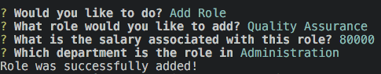
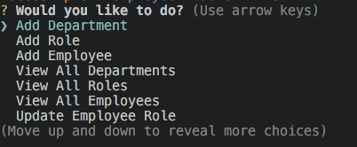
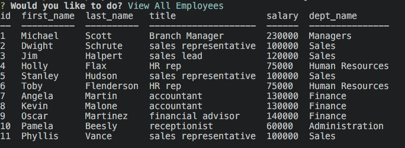

# employee-tracker
 
## Description
This repository contains the code used to create an employee tracker application. Designed for business owners,the app allows the user to easily view and manage the employees, departments, and roles within a designated employee database. 

### Technologies
* Javascript
* MySql
* node.js

### Dependencies
* [Inquirer package](https://www.npmjs.com/package/inquirer)
* [MySQL](https://www.npmjs.com/package/mysql)
* [console.table](https://www.npmjs.com/package/console.table)

### Installatiohn
In order to install necessary dependencies, please run the following command: npm i install

### Features
Command line allows users to:
* add new departments, roles and employees
* view all employees
* view all employees by department or role
* update employee roles

### Functionality
The employee-tracker is initialized when the user runs the command "node index.js" in the terminal. From there, the user will be prompted to select which command they would like to execute. Some of the possible commands include: view all employees, add new employees, add new roles, updating employees, etc. Once the function is finished, the app will return to the main menu so that the user may select another command or exit the application.

### Preview

Example of the "Add Role" funtion

Example of the main menu and all function options

Example of table produced when "View All Employees" function is selected

#### Link
